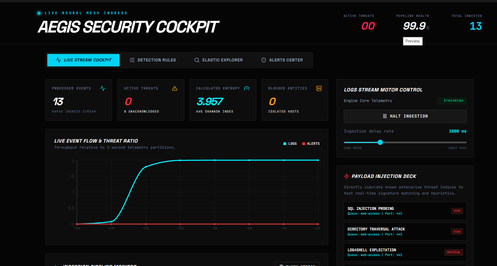
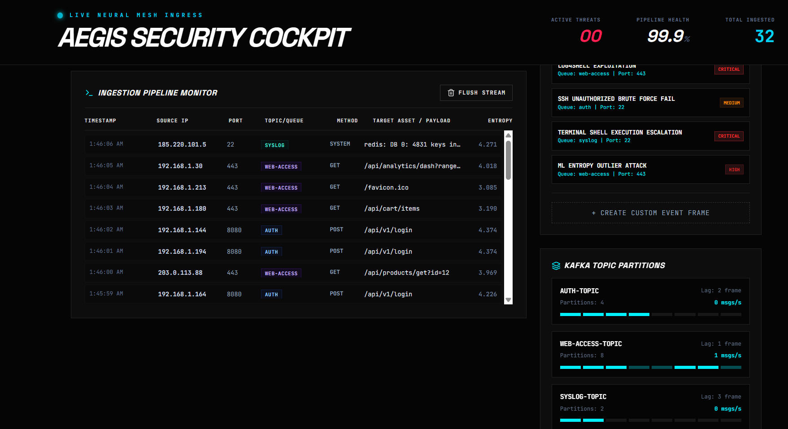
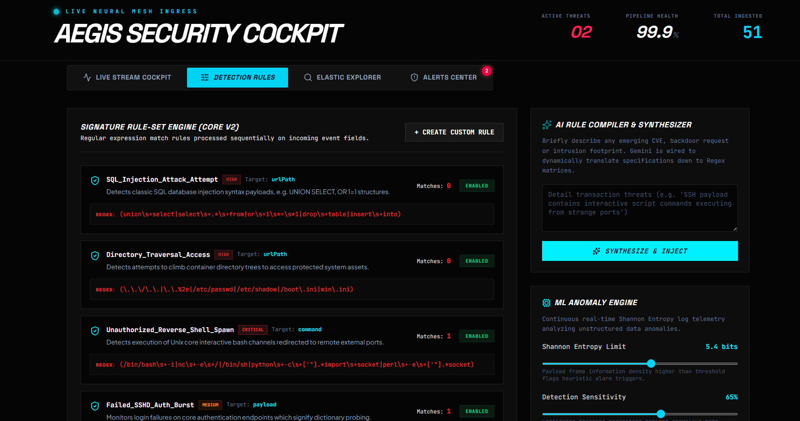
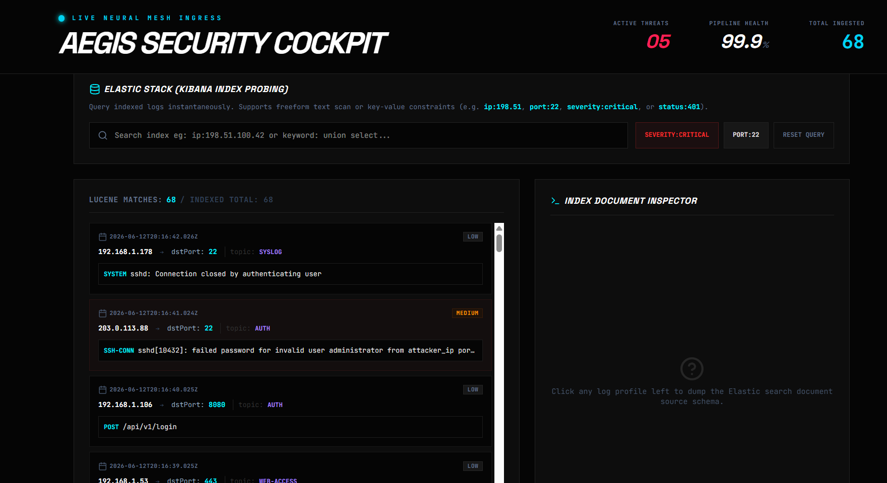
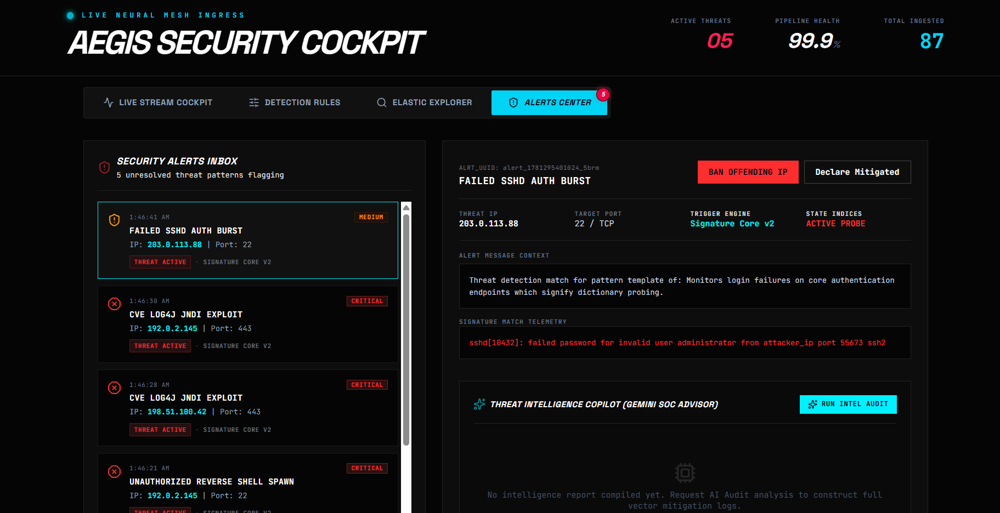

🛡️ AEGIS Security Cockpit — AI-Powered Real-Time Threat Detection Platform

### Real-Time Threat Detection, Event Streaming & Security Intelligence using Python, Kafka, Elastic Stack, Docker & Streamlit

An AI-powered cybersecurity monitoring platform built for real-time threat detection, streaming log analysis, anomaly detection, attack pattern monitoring, and SOC-driven security intelligence using Kafka pipelines, Elastic observability, and machine learning-based heuristics.

 

  
  
  
  
  

---

🚀 Business Problem

Modern security teams struggle with:

✨ Real-time attack visibility  

✨ High-volume security log monitoring  

✨ Detecting attack signatures quickly  

✨ Identifying anomalous activity patterns  

✨ Managing alert fatigue in SOC environments

Traditional log monitoring systems are reactive and slow.

The **AEGIS Security Cockpit** solves this by combining **real-time streaming telemetry, threat detection, anomaly scoring, Elastic observability, and AI-powered security intelligence** into a unified SOC platform.

---

🎯 Project Objectives

✅ Detect real-time cyber threats  

✅ Process high-volume log streams  

✅ Identify suspicious attack behavior  

✅ Perform anomaly detection on telemetry data  

✅ Trigger automated threat alerts  

✅ Improve SOC visibility and incident response

---

🛠️ Tech Stack

| Technology | Purpose |
|------------|----------|
| Python | Threat analytics & detection |
| Kafka | Real-time event streaming |
| Elastic Stack | Log indexing & querying |
| Docker | Containerized deployment |
| Streamlit | Security cockpit UI |
| Machine Learning | Threat anomaly detection |
| Regex Rules Engine | Signature-based attack detection |
| Gemini AI | Threat intelligence assistance |

---

📊 Live Stream Security Cockpit

The cockpit dashboard provides real-time telemetry monitoring across streaming infrastructure.

Key monitored indicators:

✨ Processed event ingestion  

✨ Active threat tracking  

✨ Pipeline health monitoring  

✨ Threat entropy scoring  

✨ Blocked malicious entities

The platform visualizes streaming event flow and attack ratios for real-time SOC observability.

 

  

---

📡 Real-Time Log Ingestion & Kafka Monitoring

The platform continuously ingests security logs using a Kafka-driven streaming architecture.

Capabilities include:

✨ Event stream monitoring  

✨ Kafka topic partition tracking  

✨ Log entropy monitoring  

✨ Source IP telemetry analysis  

✨ Payload-based threat inspection

Business value:

✅ Faster incident detection  

✅ Real-time stream observability  

✅ Reduced investigation delays  

✅ Better infrastructure monitoring

 

  

---

🧠 Threat Detection Rules & ML Engine

The platform combines rule-based detection with ML-powered anomaly scoring.

Detection capabilities:

✅ SQL Injection detection  

✅ Directory traversal attacks  

✅ Unauthorized shell execution  

✅ SSH brute-force detection  

✅ Behavioral anomaly scoring

The system uses:

✨ Signature-based regex engines  

✨ Shannon entropy anomaly analysis  

✨ Threat sensitivity tuning  

✨ Real-time detection thresholds

 

  

---

🔍 Elastic Search Explorer & Threat Investigation

Security teams can inspect indexed logs in real time using Elastic-powered telemetry search.

Capabilities include:

✨ Log indexing inspection  

✨ Threat filtering by severity  

✨ IP-based telemetry tracing  

✨ Attack payload investigation  

✨ Searchable incident history

This helps analysts investigate suspicious behavior faster.

 

  

---

🚨 Alerts Center & Incident Intelligence

The platform automatically raises alerts when malicious activity patterns are detected.

Capabilities include:

✨ Automated alert generation  

✨ Threat prioritization  

✨ Security incident monitoring  

✨ Malicious IP investigation  

✨ Threat mitigation workflows

Supported security response actions:

✅ Threat containment  

✅ Attack investigation  

✅ Incident escalation  

✅ AI-assisted threat intelligence

 

  

---

📌 Key Features

✨ Kafka-Based Streaming Pipeline  

✨ Real-Time Threat Detection  

✨ Elastic Security Log Explorer  

✨ Signature-Based Detection Engine  

✨ ML-Based Anomaly Detection  

✨ SOC Alert Management  

✨ Threat Intelligence Dashboard  

✨ Containerized Security Deployment  

✨ AI-Assisted Security Analysis

---

📊 Security Impact

✅ Improved real-time threat visibility  

✅ Reduced manual incident analysis time  

✅ Faster attack detection using streaming telemetry  

✅ Automated anomaly detection and alerting  

✅ Enhanced SOC monitoring efficiency

---

🧠 Security Concepts Used

python
Real-Time Event Streaming
Threat Detection
Security Telemetry
Anomaly Detection
Log Analytics
SOC Monitoring
Shannon Entropy Analysis
Behavioral Threat Detection
Regex-Based Signatures
Incident Response

🧠 Infrastructure & Security Stack

Kafka Event Streaming
Elastic Stack (Elasticsearch + Kibana)
Docker Containers
Security Log Ingestion
Threat Intelligence Pipelines
Real-Time Monitoring
Attack Signature Matching
ML Threat Scoring

📌 Future Enhancements

✨ SIEM integration

✨ Threat intelligence feeds

✨ Automated incident remediation

✨ CVE vulnerability enrichment

✨ Advanced behavioral attack detection

👩‍💻 Author

Sankeerthana Verneni

Aspiring Cybersecurity Engineer • Threat Detection • Security Analytics • AI/ML
